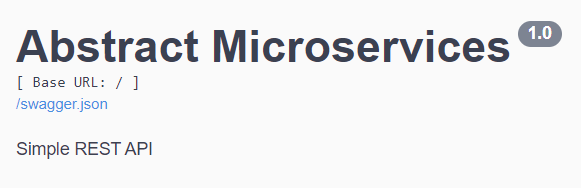

# Abstract Microservices

This is a simple web application using REST APIs, which will be a reporting service for an IoT platform,
and will be able to handle simple information storage and retrieval requests for sensor readings of the following
3 types of sensors: 

* Temperature Sensor 
* Humidity Sensor 
* Acoustic sensor 


## Installation

Install with pip

```bash
  pip install -r requirements.txt
```
    
## Deployment

To deploy this project run  ``` app.py```


## UI by Swagger


Hosted Locally
http://localhost:5000/swagger/
## Authors

- [@ChristosK17](https://github.com/ChristosK17/Abstract_Microservices)

